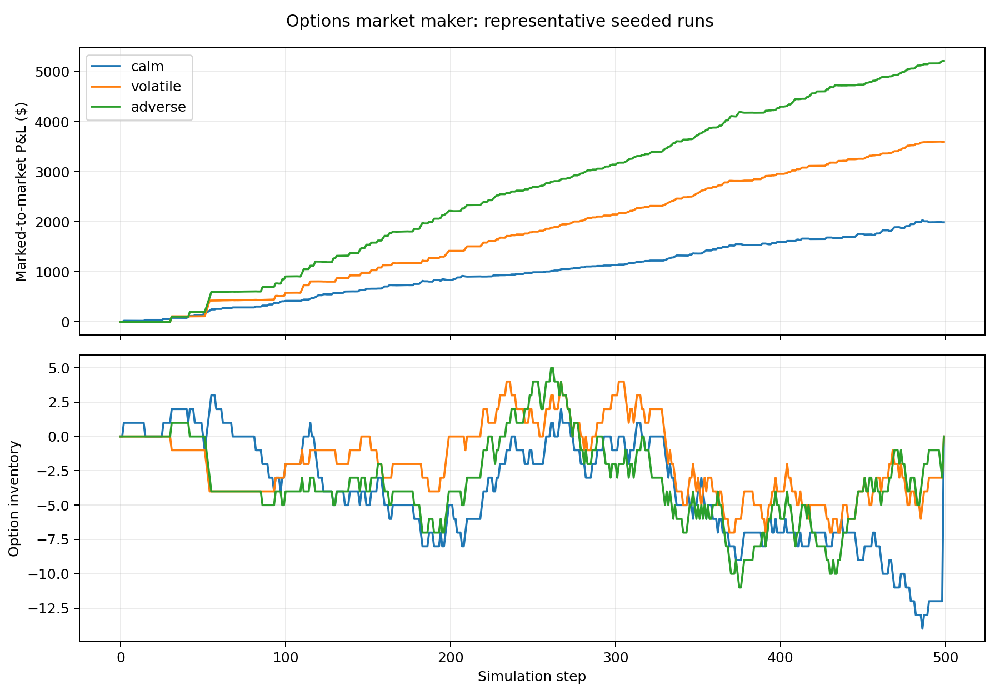

# Options Pricing and Market-Making Simulator

A reproducible research project that prices European options with Black-Scholes, calculates analytical Greeks, generates inventory-aware bid/ask quotes, simulates customer order flow, delta-hedges option inventory, and compares performance across calm, volatile, and adverse-selection regimes.

## What the project demonstrates

- Black-Scholes call and put pricing, plus delta, gamma, vega, theta, and rho.
- Dynamic spreads that widen with volatility and adverse-selection risk.
- Inventory skew: long inventory lowers both quotes; short inventory raises them.
- Hard inventory limits and discrete delta hedging in the underlying at each simulation step.
- Explicit option fees and proportional stock-hedging costs.
- Mark-to-market P&L, maximum drawdown, inventory exposure, trade count, and a clearly labelled Sharpe-like diagnostic.
- Reproducible seeded Monte Carlo experiments across three regimes. Customer
  arrival probabilities are calibrated per discrete simulation step rather
  than interpreted as calendar-time intensities.

## Run it

From the project folder:

```bash
python run.py --runs 50 --output outputs
```

Run the tests without installing extra test frameworks:

```bash
PYTHONPATH=src python -m unittest discover -s tests -v
```

Or install the package locally:

```bash
python -m pip install -e .
options-mm --runs 50 --output outputs
```

The output folder contains representative step-level CSV files, all run summaries, an aggregated regime comparison, and a P&L/inventory chart.

## Results

Results from 150 seeded Monte Carlo simulations, comprising 50 runs per synthetic market regime:

| Regime | Mean P&L | P&L standard deviation | Mean maximum drawdown | Mean trades |
|---|---:|---:|---:|---:|
| Calm | $2,489.80 | $518.64 | $16.98 | 139.88 |
| Volatile | $3,678.99 | $1,181.42 | $20.05 | 72.38 |
| Adverse selection | $4,859.56 | $1,390.93 | $18.79 | 92.14 |



The table reports averages across seeded simulations, while the chart shows one representative run from each regime. These synthetic results illustrate model behaviour under the chosen assumptions and do not represent historical or expected real-market returns.
 
## Model flow

1. Simulate the underlying stock using geometric Brownian motion.
2. Recalculate the option's Black-Scholes value and Greeks at every step.
3. Build a reservation price by shifting fair value against current inventory.
4. Add a risk-sensitive half-spread to create bid and ask quotes.
5. Simulate customers choosing whether to trade. Adverse-selection risk makes correctly informed flow more likely before stock moves.
6. Update option inventory and cash, then trade stock to offset option delta.
7. Mark the portfolio to market and record risk/performance fields.
8. Liquidate remaining positions at the end and aggregate results across seeds.

## Important assumptions and limitations

This is an educational simulator, not a production trading system. It assumes European exercise, lognormal stock returns, constant regime volatility, a constant risk-free rate, no dividends, frictionless option liquidation at the final model value, simplified customer arrivals, and immediate fills of stock hedges. Black-Scholes fair value is also used by the quoting engine, so model misspecification risk is not captured. The Sharpe-like statistic is not an annualised live-strategy Sharpe ratio.

These limitations are intentional and documented: the goal is to isolate the relationship between pricing, Greeks, quoting, inventory, adverse selection, hedging costs, and P&L.
